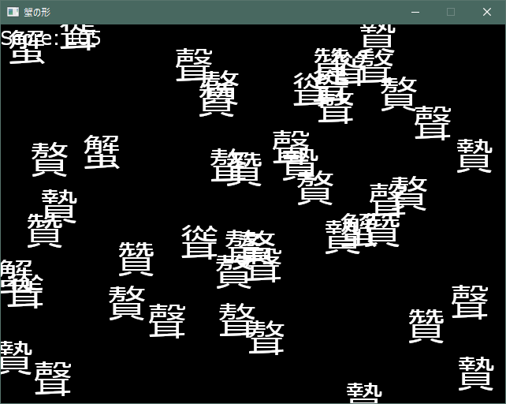

# 蟹の形

C#とAltseedで作くられたゲーム.  
おまえら土日までに一本ゲーム作るスレ参加作品  

# 操作方法

* カーソルキー ... 移動
* Z ... 自分の文字を切り替える

自分と同じ文字と重なったらその文字は消える.  
短い間隔で文字を消すほどスコアを稼げる.  
全ての文字を消すをゲームクリア.  

# Copyright
Copyright (C) 2016 akitsu sanae.  
Distributed under the Boost Software License, Version 1.0. 
(See accompanying file LICENSE_1_0.txt or copy at http://www.boost/org/LICENSE_1_0.txt)  

This game uses [Altseed](https://altseed.github.io)

